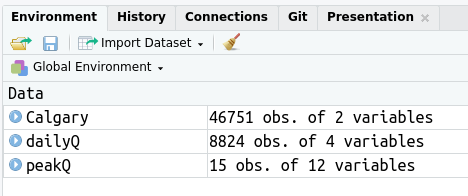
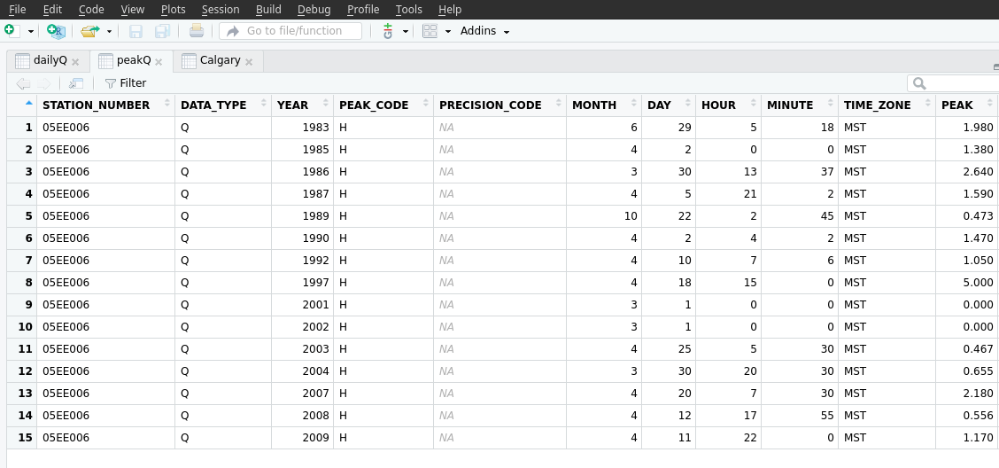

R basics 1 - Working with data  
========================================================
author: Kevin Shook
date: November 30, 2017
autosize: true

R equals
========================================================
- **R** has 3 equals signs: 
- ```<-``` is used for assigning a value:
  - to insert the symbol in Rstudio, type **[Alt][-]**

```r
a <- seq(1,5)
a
```

```
[1] 1 2 3 4 5
```
***
- ```==``` is used for comparing values
  - used in ```if``` statements or for selecting by value

```r
a == 5
```

```
[1] FALSE FALSE FALSE FALSE  TRUE
```


- ```=``` is used for specifying parameters in functions:

```r
mean(x = a)
```

```
[1] 3
```

Data types
========================================================
- Classes of data include numeric, character, logical
- Types of data include scalars, vectors, data frames, matrices, arrays, lists, and factors
- Vectors are created using c()

```r
a <- c(1,2,3,4,5)
a
```

```
[1] 1 2 3 4 5
```

```r
class(a)
```

```
[1] "numeric"
```

Character strings
========================================================

```r
a <- c("1", "2", "dog")
a
```

```
[1] "1"   "2"   "dog"
```
- ```paste()`` combines character strings

```r
paste('dog', 'cat', sep = "")
```

```
[1] "dogcat"
```
***

```r
paste('dog', 'cat', sep = "-")
```

```
[1] "dog-cat"
```

Data frames
========================================================
- Data frames are collections of vectors  
- The vectors can be of any type, but must have the same size

```r
animal <- c("cat", "horse", "dog", "shark")
mammal <- c(TRUE, TRUE, TRUE, FALSE)
df <- data.frame(animal, mammal, stringsAsFactors = FALSE)
df
```

```
  animal mammal
1    cat   TRUE
2  horse   TRUE
3    dog   TRUE
4  shark  FALSE
```

Factors
========================================================
- Factors look like character variables, but are actually numbers  
- Good for categorizing values

```r
animal <- c("cat", "horse", "dog", "shark")
type <- c("mammal", "mammal", "mammal", "fish")
type <- factor(type)
df2 <- data.frame(animal, type, stringsAsFactors = FALSE)
```
***

```r
df2
```

```
  animal   type
1    cat mammal
2  horse mammal
3    dog mammal
4  shark   fish
```

```r
summary(df2)
```

```
    animal              type  
 Length:4           fish  :1  
 Class :character   mammal:3  
 Mode  :character             
```

Lists
========================================================
- Lists can contain any other data types, which can be of any length  
- However, lists are a pain to use
- You reference list elements using 2 sets of square brackets, i.e. ```[[]]```

```r
b <- list("my list", df2)
b
```

```
[[1]]
[1] "my list"

[[2]]
  animal   type
1    cat mammal
2  horse mammal
3    dog mammal
4  shark   fish
```
***

```r
b[[2]]$animal
```

```
[1] "cat"   "horse" "dog"   "shark"
```

names() lists all of the names in an object
========================================================

```r
names(df2)
```

```
[1] "animal" "type"  
```

```r
names(df2)[1]
```

```
[1] "animal"
```

***
- Also renames variables

```r
names(df2) <- c("Animal", "Type") 
df2
```

```
  Animal   Type
1    cat mammal
2  horse mammal
3    dog mammal
4  shark   fish
```

File paths
========================================================
- **R** uses Unix-style delimiters, i.e. ```/```, even in Windows
  - the symbol ```\``` is used to indicate special (escape) characters
- To see your current directory use ```getwd()```  
- In Linux or OSX :

```
[1] "/home/kevin/data/projects/R_training/R_basics_1"
```

***
- In Windows you will see something like  
```
  [1] "C:/Users/kevin/Documents"
```
- In Windows you can also use 2 backslashes: ```\\``` as delimiters

Loading and saving variables
========================================================
- Sets of variables can be saved to a binary file using ```save()```
  - saves to file with extension ```.RData```
- Use ```load()``` to load values

```r
load("R_basics_1.RData")
```
- Need to specify the path, if the file is not in the current directory
- Click on the variable name in the Environment tab to see more info 
  - double-click to display the data frame as a table

***


Viewing data frames
========================================================


Data frame referencing
========================================================
- You need to be able to select parts of a data frame
- Each variable is identified by name using ```$```

```r
peakQ$YEAR
```

```
 [1] 1983 1985 1986 1987 1989 1990 1992 1997 2001 2002 2003 2004 2007 2008
[15] 2009
```

***
- values can be indexed by the variable name and row number

```r
peakQ$YEAR[3]
```

```
[1] 1986
```

***
or by row and column number

```r
peakQ[3, 3]
```

```
[1] 1986
```

Data frame referencing 2
========================================================
- Omit the row or column to specify *all* of the rows or columns

```r
peakQ[, 3]
```

```
 [1] 1983 1985 1986 1987 1989 1990 1992 1997 2001 2002 2003 2004 2007 2008
[15] 2009
```
 ***
- You can specify *some* of the rows or columns
- as a range of rows/columns using ```:```peakQ[1:3, 3]
```
***
- or with a vector

```r
peakQ[c(1, 4), 3]
```

```
[1] 1983 1987
```

Data frame referencing 3
========================================================
- Can also specify using logical values
  - only returns rows or columns where the expression is ```TRUE```

```r
peakQ[peakQ$YEAR >= 1990, c(3, 11)]
```

```
   YEAR  PEAK
6  1990 1.470
7  1992 1.050
8  1997 5.000
9  2001 0.000
10 2002 0.000
11 2003 0.467
12 2004 0.655
13 2007 2.180
14 2008 0.556
15 2009 1.170
```

Data frame referencing 4
========================================================
- You can omit rows and/or columns using the minus sign

```r
peakQ[, 3]
```

```
 [1] 1983 1985 1986 1987 1989 1990 1992 1997 2001 2002 2003 2004 2007 2008
[15] 2009
```

```r
peakQ[-(c(1, 3, 4)), 3]
```

```
 [1] 1985 1989 1990 1992 1997 2001 2002 2003 2004 2007 2008 2009
```

Dates
========================================================
- In **R**, dates are created using ```as.Date()```
  - converts character to a ``Date`` object
    - number of days since 1970-01-01
  - need to specify the date format if not y-m-d
  - can also use ```format()``` to convert a date to another format
  - ?strptime to get date formatting strings

Date examples
========================================================

```r
d <- as.Date("2017-11-30")
d
```

```
[1] "2017-11-30"
```

```r
d + 1
```

```
[1] "2017-12-01"
```

***
- Changing date output format

```r
format(d, format = "%A, %B %d, %Y")
```

```
[1] "Thursday, November 30, 2017"
```


Times
========================================================
- Several ways of converting date-time strings to objects
- Simplest is probably to use ```as.POSIXct()```
  - seconds since 1970-01-01 00:00
  - have to specity the format if not y-m-d h:m:s
  - have to specify the time zone of the data, if not yours

Time examples
========================================================

```r
dt <- as.POSIXct("2017-11-30 12:30", format = "%Y-%m-%d %H:%M")
dt
```

```
[1] "2017-11-30 12:30:00 CST"
```

```r
dt <- as.POSIXct("30/11/2017 12:30", format = "%d/%m/%Y %H:%M")
dt
```

```
[1] "2017-11-30 12:30:00 CST"
```

```r
dt + 1
```

```
[1] "2017-11-30 12:30:01 CST"
```

Exercise #1
========================================================
- ```load()``` the file ```R_basics1.RData```
- Will be working with the data frame ```peakQ```
- Delete these variables: 
  - STATION_NUMBER, DATA_TYPE, PEAK_CODE, PRECISION_CODE
- Add a new variable called ```peak_time``` and

***
  - fill it with the date and time of the peak in the format YEAR-MONTH-DAY HOUR:MINUTE
    - hint - use ```paste()```
  - convert ```peak_time``` to an **R** date/time
  - plot the peak flows against the date/time
  
Exercise #1 solution
========================================================

```r
load("R_basics_1.RData")
peakQ <- peakQ[, -c(1, 2, 4, 5)]
peakQ$datetime <- paste(peakQ$YEAR,"-", peakQ$MONTH, "-", peakQ$DAY," ", peakQ$HOUR,":", peakQ$MINUTE, sep = "")

peakQ$datetime <- as.POSIXct(peakQ$datetime, format = "%Y-%m-%d %H:%M", tz = "MST")

head(peakQ$datetime)
```

```
[1] "1983-06-29 05:18:00 MST" "1985-04-02 00:00:00 MST"
[3] "1986-03-30 13:37:00 MST" "1987-04-05 21:02:00 MST"
[5] "1989-10-22 02:45:00 MST" "1990-04-02 04:02:00 MST"
```

Exercise #1 graph
========================================================

```r
plot(peakQ$datetime, peakQ$PEAK, type = "p")
```


***


```r
library(ggplot2)
ggplot(peakQ, aes(datetime, PEAK)) + geom_point() + theme_gray(24)
```


Sorting
========================================================
- There is a ```sort`` command - don't use it as it only works for vectors
- Use ```order()``` instead

```r
order(x, decreasing = FALSE)
```
- Returns the index of the values, in ascending (default) or descending order.

Ordering examples
========================================================

```r
peakQ$PEAK
```

```
 [1] 1.980 1.380 2.640 1.590 0.473 1.470 1.050 5.000 0.000 0.000 0.467
[12] 0.655 2.180 0.556 1.170
```

```r
order(peakQ$PEAK)
```

```
 [1]  9 10 11  5 14 12  7 15  2  6  4  1 13  3  8
```
***

```r
peakQ$PEAK[order(peakQ$PEAK)]
```

```
 [1] 0.000 0.000 0.467 0.473 0.556 0.655 1.050 1.170 1.380 1.470 1.590
[12] 1.980 2.180 2.640 5.000
```

```r
peakQ$YEAR[order(peakQ$PEAK)]
```

```
 [1] 2001 2002 2003 1989 2008 2004 1992 2009 1985 1990 1987 1983 2007 1986
[15] 1997
```

Aggregating
========================================================
- Use ```aggregate()``` to summarize data by subsets
  - like a pivot table in a spreadsheet
  - need to specify data, variable to summarize by, and the function to use

```r
aggregate(x, by = list(variables), FUN = function)
```
- Covered last week in the **Introduction to R**
- Aggregation "by" variables are in a list - can specify more than one variable
- Can specify *any* function which accepts a vector of values
  - popular functions are ```min```, ```max```, ```mean```, ```sum```
  
Exercise #2
========================================================
- look at the data frame ```Calgary``` (already loaded)
- convert the date to an R date
- calculate the total precipitation for each year

- hints:
  - use ```as.Date()``` to convert the character date to an R date 
  - use ```format(Calgary$date, format = "%Y")``` to create variable for the year
  - use ```aggregate()``` to get the total  
  
- extra work:
  - calculate the total precipitation for each month of each year
  

Exercise #2 solution
========================================================

```r
Calgary <- na.omit(Calgary)
Calgary$date <- as.Date(Calgary$date, format = "%Y-%m-%d")
summary(Calgary)
```

```
      date                precip      
 Min.   :1885-01-01   Min.   : 0.000  
 1st Qu.:1916-11-18   1st Qu.: 0.000  
 Median :1948-10-05   Median : 0.000  
 Mean   :1948-10-05   Mean   : 1.278  
 3rd Qu.:1980-08-22   3rd Qu.: 0.480  
 Max.   :2012-07-11   Max.   :99.330  
```

Add year and month and aggregate
========================================================

```r
Calgary$year <- as.numeric(format(Calgary$date, format = "%Y"))
head(Calgary, n=3)
```

```
        date precip year
1 1885-01-01      0 1885
2 1885-01-02      0 1885
3 1885-01-03      0 1885
```

```r
yearly <- aggregate(Calgary$precip, by = list(Calgary$year), FUN = "sum")
head(yearly, n=3)
```

```
  Group.1      x
1    1885 344.37
2    1886 300.45
3    1887 371.60
```

Extra work
========================================================

```r
Calgary$month <- as.numeric(format(Calgary$date, format = "%m"))
month_by_year <- aggregate(Calgary$precip, by = list(Calgary$month, Calgary$year),
                    FUN = c("sum"))
head(month_by_year)
```

```
  Group.1 Group.2     x
1       1    1885 16.06
2       2    1885 24.06
3       3    1885 21.21
4       4    1885 12.32
5       5    1885 12.47
6       6    1885 57.22
```

Another method
========================================================

```r
Calgary$year_month <- format(Calgary$date, format = "%Y-%m")
month_by_year2  <- aggregate(Calgary$precip, by = list(Calgary$year_month),
                              FUN = "sum")
head(month_by_year2)
```

```
  Group.1     x
1 1885-01 16.06
2 1885-02 24.06
3 1885-03 21.21
4 1885-04 12.32
5 1885-05 12.47
6 1885-06 57.22
```

Finding values
========================================================
- it's often useful to find the location (row number) of a value in a data frame
- use ```which(), which.max(), which.min()```

```r
max(Calgary$precip)
```

```
[1] 99.33
```

```r
which.max(Calgary$precip)
```

```
[1] 15535
```
***

```r
Calgary[which.max(Calgary$precip),1:3]
```

```
            date precip year
15535 1927-07-15  99.33 1927
```

Adding rows and columns
========================================================
- combining 2 or more data frames
- you can add extra columns using ```cbind()``` (column bind)
  - all columns must have the same number of rows  
- extra rows can be added using ```rbind()``` (row bind)
  - all data frames must have same number of columns with the same names

Adding rows
========================================================

```r
df
```

```
  animal mammal
1    cat   TRUE
2  horse   TRUE
3    dog   TRUE
4  shark  FALSE
```
***

```r
df <- rbind(df, c("chicken", FALSE))
df
```

```
   animal mammal
1     cat   TRUE
2   horse   TRUE
3     dog   TRUE
4   shark  FALSE
5 chicken  FALSE
```
  
Combining data frames
========================================================
- often need to combine data frames with differing numbers of rows and/or columns
  - like a LOOKUP function in a spreadsheet  

```r
 merge(x, y, by = "variable")
```
- data frames ```x``` and ```y``` need to have a common variable to merge **by**
  - easiest if the variable has the same name in both data frames
- the resulting data frame will have all columns *except*
   that the common column will only appear once

Exercise #3
========================================================
- Plot the instaneous peak flows (in data frame ```peakQ```) against the mean flows on the same day (in data frame  ```dailyQ```)
- Hints:
  - merge ```peakQ``` and ```dailyQ``` by the date
  - requires converting the variable ```datetime``` in ```peakQ``` to a date
    - use the function ```as.Date()```
  - plot the merged data frame

Exercise #3 solution
========================================================
- Add the date to ```peakQ```

```r
peakQ$date <- as.Date(peakQ$datetime)
head(peakQ, n=3)
```

```
  YEAR MONTH DAY HOUR MINUTE TIME_ZONE PEAK SYMBOL            datetime
1 1983     6  29    5     18       MST 1.98        1983-06-29 05:18:00
2 1985     4   2    0      0       MST 1.38      B 1985-04-02 00:00:00
3 1986     3  30   13     37       MST 2.64        1986-03-30 13:37:00
        date
1 1983-06-29
2 1985-04-02
3 1986-03-30
```

Exercise #3 solution cont'd
========================================================
- Merge data frames

```r
merged <- merge(peakQ, dailyQ, by = "date")
head(merged, n=3)
```

```
        date YEAR MONTH DAY HOUR MINUTE TIME_ZONE PEAK SYMBOL
1 1983-06-29 1983     6  29    5     18       MST 1.98       
2 1985-04-02 1985     4   2    0      0       MST 1.38      B
3 1986-03-30 1986     3  30   13     37       MST 2.64       
             datetime station    Q code
1 1983-06-29 05:18:00 05EE006 1.79     
2 1985-04-02 00:00:00 05EE006 1.23    B
3 1986-03-30 13:37:00 05EE006 1.91     
```


Exercise #3 graph
========================================================

```r
ggplot(merged, aes(Q, PEAK)) + geom_point(colour = "red", size = 3) + 
  geom_abline(slope = 1, intercept = 0) + xlab("Mean daily discharge (m³/s)") +
  ylab("Instantaneous peak discharge (m³/s)") + theme_bw(20)
```


